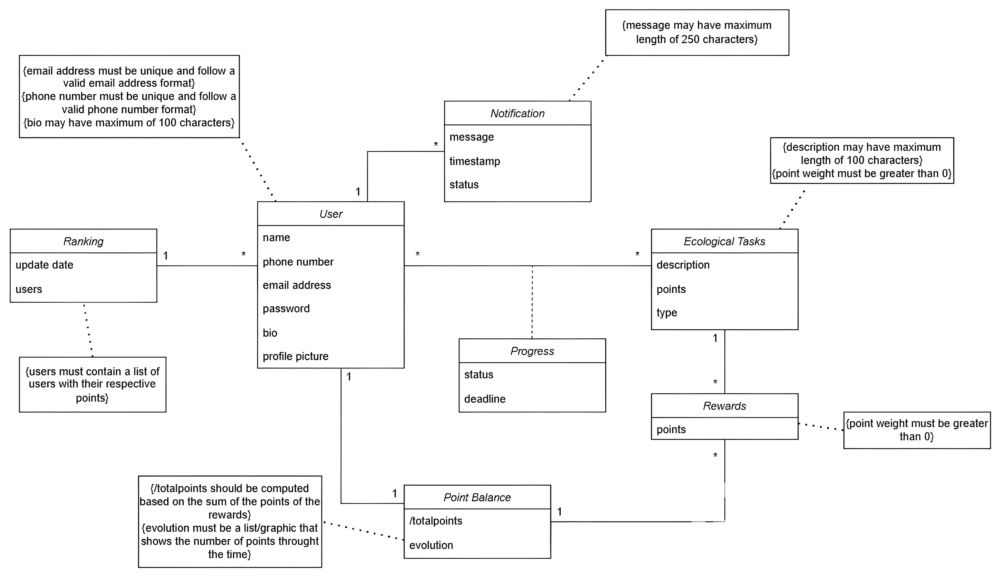
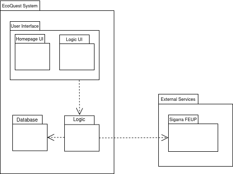
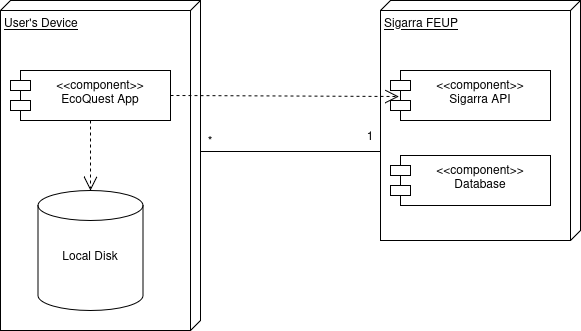
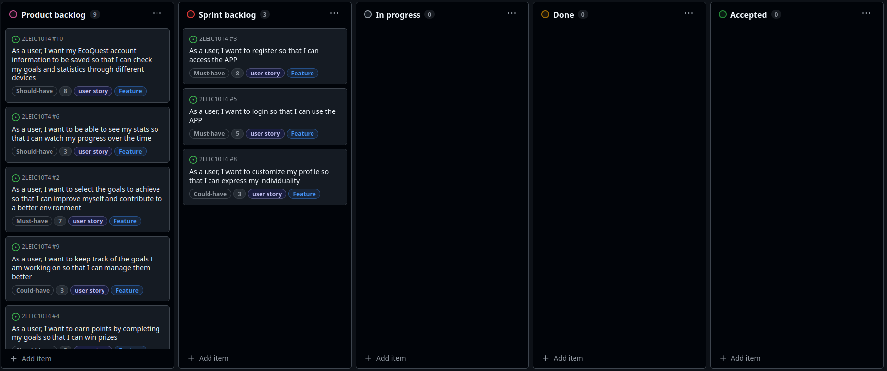
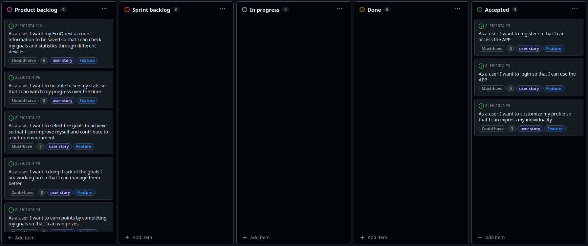
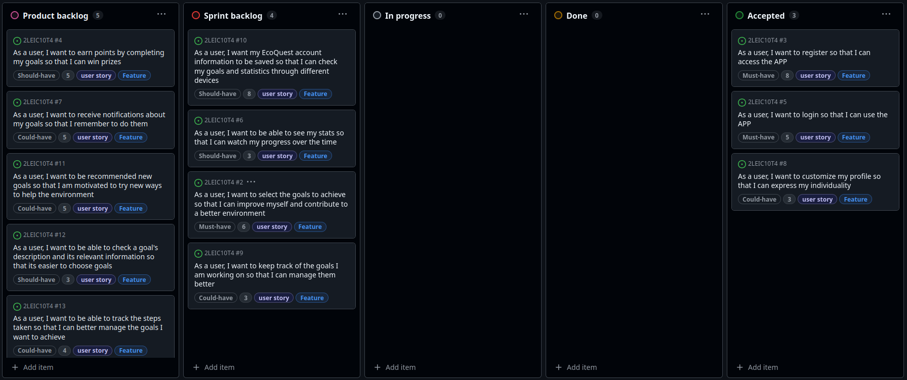
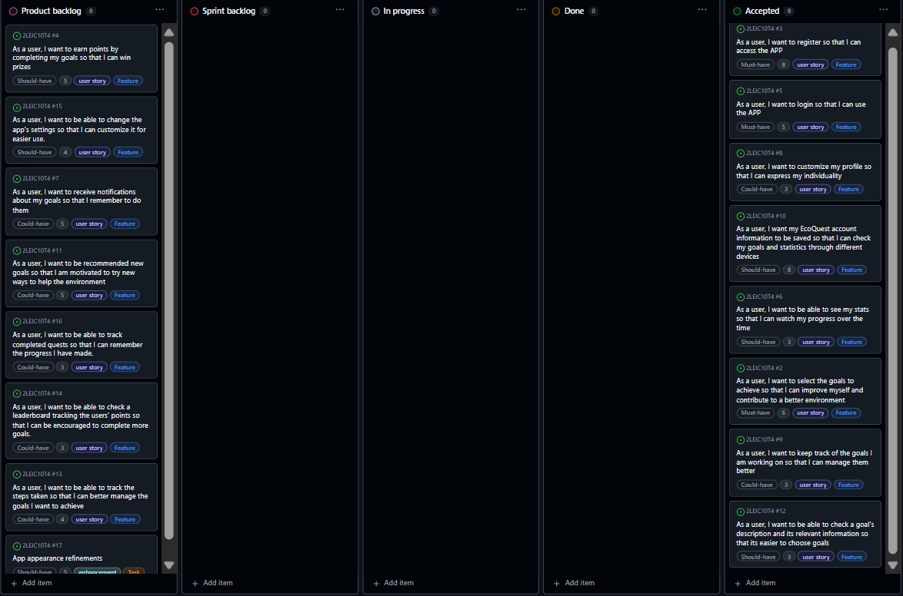
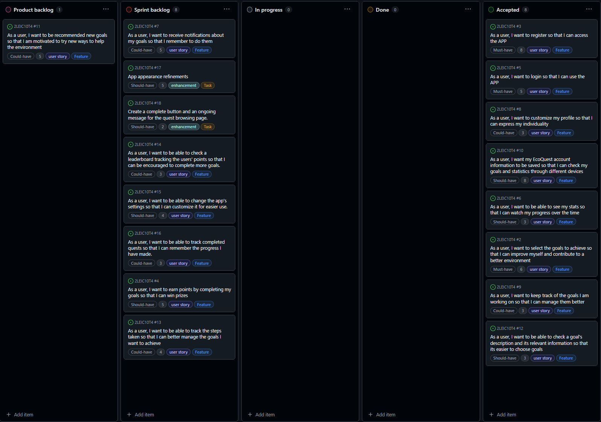
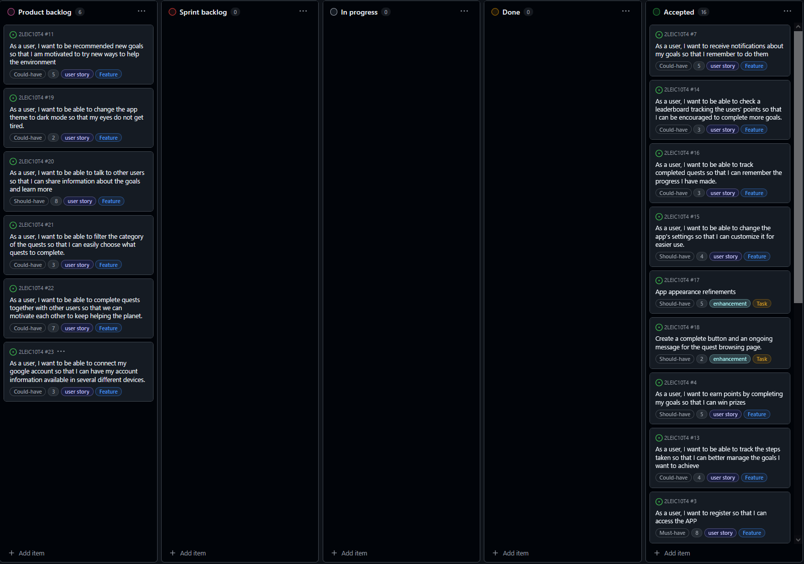

# EcoQuest Development Report

Welcome to the documentation pages of EcoQuest!

This Software Development Report, tailored for LEIC-ES-2024-25, provides comprehensive details about EcoQuest, from high-level vision to low-level implementation decisions. It’s organised by the following activities. 

* [Business modeling](#Business-Modelling) 
  * [Product Vision](#Product-Vision)
  * [Features and Assumptions](#Features-and-Assumptions)
  * [Elevator Pitch](#Elevator-pitch)
* [Requirements](#Requirements)
  * [User stories](#User-stories)
  * [Domain model](#Domain-model)
* [Architecture and Design](#Architecture-And-Design)
  * [Logical architecture](#Logical-Architecture)
  * [Physical architecture](#Physical-Architecture)
  * [Vertical prototype](#Vertical-Prototype)
* [Project management](#Project-Management)
  * [Sprint 0](#Sprint-0)
  * [Sprint 1](#Sprint-1)
  * [Sprint 2](#Sprint-2)
  * [Sprint 3](#Sprint-3)
  * [Sprint 4](#Sprint-4)
  * [Final Release](#Final-Release)

Contributions are expected to be made exclusively by the initial team, but we may open them to the community, after the course, in all areas and topics: requirements, technologies, development, experimentation, testing, etc.

Please contact us!

Thank you!

* António Pais / up202305444@up.pt 
* Francisco Fonte / up202305597@up.pt
* João Correia / up201905892@up.pt
* Gustavo Madureira / up202304978@up.pt

---
## Business Modelling

Business modeling in software development involves defining the product's vision, understanding market needs, aligning features with user expectations, and setting the groundwork for strategic planning and execution.

### Product Vision

<!-- Old product Vision

  <strong>Improve yourself to improve the world with EcoQuest</strong>

Our app is about self-improvement by finishing different types of goals that not only helps the user but also makes the environment more sustainable. It is intended for people of all ages, because there is no age to start having a eco-friendly lifestyle.

-->

Improve the world with EcoQuest achieving self-improvement by finishing different types of goals, helping both the user and the environment.

<!-- 
Start by defining a clear and concise vision for your app, to help members of the team, contributors, and users into focusing their often disparate views into a concise, visual, and short textual form. 

The vision should provide a "high concept" of the product for marketers, developers, and managers.

A product vision describes the essential of the product and sets the direction to where a product is headed, and what the product will deliver in the future. 

**We favor a catchy and concise statement, ideally one sentence.**

We suggest you use the product vision template described in the following link:
* [How To Create A Convincing Product Vision To Guide Your Team, by uxstudioteam.com](https://uxstudioteam.com/ux-blog/product-vision/)

To learn more about how to write a good product vision, please see:
* [Vision, by scrumbook.org](http://scrumbook.org/value-stream/vision.html)
* [Product Management: Product Vision, by ProductPlan](https://www.productplan.com/glossary/product-vision/)
* [How to write a vision, by dummies.com](https://www.dummies.com/business/marketing/branding/how-to-write-vision-and-mission-statements-for-your-brand/)
* [20 Inspiring Vision Statement Examples (2019 Updated), by lifehack.org](https://www.lifehack.org/articles/work/20-sample-vision-statement-for-the-new-startup.html)
-->

### Features and Assumptions
<!-- 
Indicate an  initial/tentative list of high-level features - high-level capabilities or desired services of the system that are necessary to deliver benefits to the users.
 - Feature XPTO - a few words to briefly describe the feature
 - Feature ABCD - ...
...

Optionally, indicate an initial/tentative list of assumptions that you are doing about the app and dependencies of the app to other systems.
-->

### Elevator Pitch
<!-- 
Draft a small text to help you quickly introduce and describe your product in a short time (lift travel time ~90 seconds) and a few words (~800 characters), a technique usually known as elevator pitch.

Take a look at the following links to learn some techniques:
* [Crafting an Elevator Pitch](https://www.mindtools.com/pages/article/elevator-pitch.htm)
* [The Best Elevator Pitch Examples, Templates, and Tactics - A Guide to Writing an Unforgettable Elevator Speech, by strategypeak.com](https://strategypeak.com/elevator-pitch-examples/)
* [Top 7 Killer Elevator Pitch Examples, by toggl.com](https://blog.toggl.com/elevator-pitch-examples/)
-->

## Requirements

### User Stories

* As a **user**, I want **to register** so that **I can access the APP**.
* As a **user**, I want **to login** so that **I can use the APP**.
* As a **user**, I want **to select the goals to achieve** so that **I can improve myself and contribute to a better environment**.
* As a **user**, I want **to earn points by completing my goals** so that **I can win prizes**.
* As a **user**, I want **to be able to see my stats** so that **I can watch my progress over the time**.
* As a **user**, I want **to receive notifications about my goals** so that **I remember to do them**.
* As a **user**, I want **to customize my profile** so that **I can express my individuality**.
<!--
* As an **admin**, I want to **verify the SYSTEM** so that **I can ensure the APP runs correctly**.
* As an **admin**, I want **to register** so that **I can access the APP**.
-->

### Domain model

  

Users have a name, phone number, and email address, all unique and in valid formats, as well as a password. They can complete 'Ecological Tasks,' which have a description limited to 100 characters and a score greater than zero. Progress on each task is recorded in the 'Progress' entity, which stores the status and completion deadline.

The points earned from tasks are first registered in 'Rewards' and then transferred to 'Point Balance,' where the total score is calculated and the user's evolution is tracked over time. The ranking displays users and their scores, promoting healthy competition.

Additionally, users can make changes to their profiles, such as updating their personal information or preferences. They also have the option to receive notifications regarding updates or activities within the app, ensuring they stay informed and engaged with the platform.

<!-- 
To better understand the context of the software system, it is useful to have a simple UML class diagram with all and only the key concepts (names, attributes) and relationships involved of the problem domain addressed by your app. 
Also provide a short textual description of each concept (domain class). 

Example:
 

  

-->

## Architecture and Design
<!--
The architecture of a software system encompasses the set of key decisions about its organization. 

A well written architecture document is brief and reduces the amount of time it takes new programmers to a project to understand the code to feel able to make modifications and enhancements.

To document the architecture requires describing the decomposition of the system in their parts (high-level components) and the key behaviors and collaborations between them. 

In this section you should start by briefly describing the components of the project and their interrelations. You should describe how you solved typical problems you may have encountered, pointing to well-known architectural and design patterns, if applicable.
-->

### Logical architecture

  

Ecoquest's logical architecture is divided in two parts: the local system and the external services. The system package includes the user interface that the user interacts with, including the Homepage and the Logic interfaces. The logic and database packages are then implemented to support the functionality of our app. The external services are necessary to suplement our app with the necessary information, mainly the Sigarra database.

### Physical architecture

  

Ecoquest's physical architecture consists simply of the user device that has the Ecoquest app. This device saves information to be used by the app on the local disk and communicates with Sigarra via its API. It therefore also accesses Sigarra's database to fetch the necessary data for our features to work.

### Vertical prototype
<!--
To help on validating all the architectural, design and technological decisions made, we usually implement a vertical prototype, a thin vertical slice of the system integrating as much technologies we can.

In this subsection please describe which feature, or part of it, you have implemented, and how, together with a snapshot of the user interface, if applicable.

At this phase, instead of a complete user story, you can simply implement a small part of a feature that demonstrates thay you can use the technology, for example, show a screen with the app credits (name and authors).
-->

## Project management
<!--
Software project management is the art and science of planning and leading software projects, in which software projects are planned, implemented, monitored and controlled.

In the context of ESOF, we recommend each team to adopt a set of project management practices and tools capable of registering tasks, assigning tasks to team members, adding estimations to tasks, monitor tasks progress, and therefore being able to track their projects.

Common practices of managing agile software development with Scrum are: backlog management, release management, estimation, Sprint planning, Sprint development, acceptance tests, and Sprint retrospectives.

You can find below information and references related with the project management: 

* Backlog management: Product backlog and Sprint backlog in a [Github Projects board](https://github.com/orgs/FEUP-LEIC-ES-2023-24/projects/64);
* Release management: [v0](#), v1, v2, v3, ...;
* Sprint planning and retrospectives: 
  * plans: screenshots of Github Projects board at begin and end of each Sprint;
  * retrospectives: meeting notes in a document in the repository, addressing the following questions:
    * Did well: things we did well and should continue;
    * Do differently: things we should do differently and how;
    * Puzzles: things we don’t know yet if they are right or wrong… 
    * list of a few improvements to implement next Sprint;

-->

### Sprint 0

#### Plans
- Beginning

  

- End

  

 

#### Retrospectives
As this was sprint 0, the development board at the beginning and at the end is the same since no concrete functionality was implemented. The only release was therefore a vertical prototype to get the group used to the new workflow.
 
<strong>What went well:</strong>
  - Good group organization using github
  - All planned work completed

<strong>What could be different:</strong>
  - Better branch management when using github
  - Better understanding of dart and flutter
  - Better time management

<strong>Puzzles:</strong>
  - Parts of flutter's workflow using dart

### Sprint 1

#### Plans
- Beginning

  

- End

  

 

#### Retrospectives
In this sprint, we focused on the based of the application, mainly the authentication system (login and register).
 
<strong>What went well:</strong>
  - Good code organization
  - Most important part of the planned work completed

<strong>What could be different:</strong>
  - Better acceptance and unit tests
  - Better understanding of dart and flutter
  - Better task organization

<strong>Puzzles:</strong>
  - Flutter's widget management
  - IOS's build dificulty when compared to Android

### Sprint 2

#### Plans
- Beginning

  

- End

  

#### Retrospectives
In this sprint, we focused on the goals' page, how to select them, keep track of them and also how to check their description. We also worked on the user's page where the user can check and save their stats.
 
<strong>What went well:</strong>
- Good code organization
- Better task organization
- Most important part of the planned work completed

<strong>What could be different:</strong>
- Better unit tests
- Better understanding of dart and flutter
- Better branch and time management

<strong>Puzzles:</strong>
- Parts of flutter's workflow using dart

<strong>Things to change:</strong>
- When accepting a quest, instead of a button saying that is accepted, appear a button to confirm the completion of the goal, on the ongoing goals' page.
- The same but for the goals' page, in order to not be so complicated to confirm the completion of a goal.

### Sprint 3

#### Plans
- Beginning

  

- End

  

#### Retrospectives
In this sprint, we focused on completing the core of the app and on refining it for easier and more comfortable use. We added small new features to help the user and facilitate the usage of the app.
 
<strong>What went well:</strong>
- Good work completion pace
- Better task organization
- All of the backlog features completed

<strong>What could be different:</strong>
- Better understanding of dart and flutter
- Better branch managment
- Less confusing workflow

<strong>Puzzles:</strong>
- Writing unit tests for firebase
- Using many different APIs together

### Final Release

